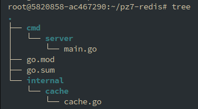
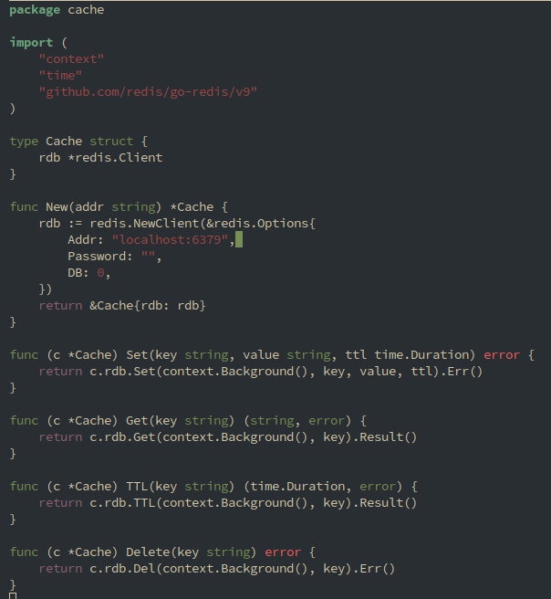
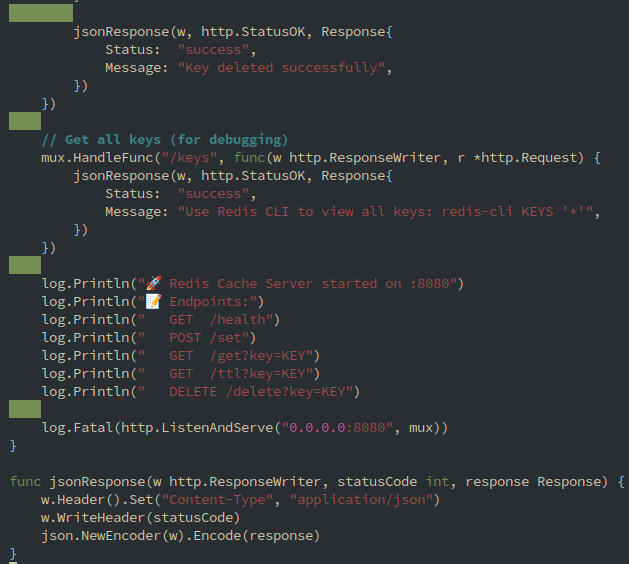
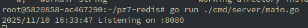
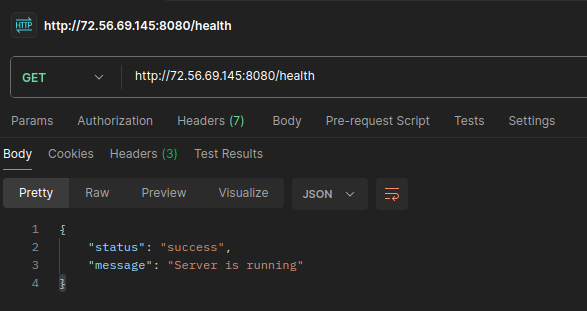
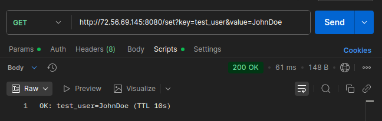
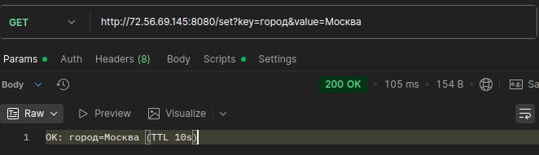
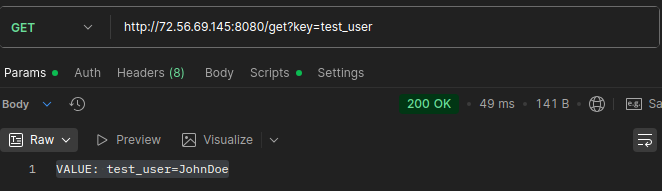

# Практическое задание № 7

# Подключение и работа с Redis (set/get, TTL). Реализация простого кэша.

Студент группы *ЭФМО-02-25 Пягай Даниил Игоревич*

# Описание

**Цели:**

    • Освоить базовые операции работы с Redis из Go-приложения.
    • Научиться использовать команды SET, GET, задавать время жизни ключей (TTL).
    • Реализовать кэширование данных для ускорения работы API.
    • Понять, в каких случаях кэш помогает снизить нагрузку на базу данных.


## Инициализация проекта

```bash
mkdir pz7-redis
cd pz7-redis
go mod init example.com/pz7-redis
go get github.com/redis/go-redis/v9
```

## Создаём структуру файлов



### Содержимое postgres.go


### Содержимое main.go


# Запуск и проверка


# Проверяем

## /Health


## Запрос /Set



## Запрос /Get


## Запрос /ttl
.png
